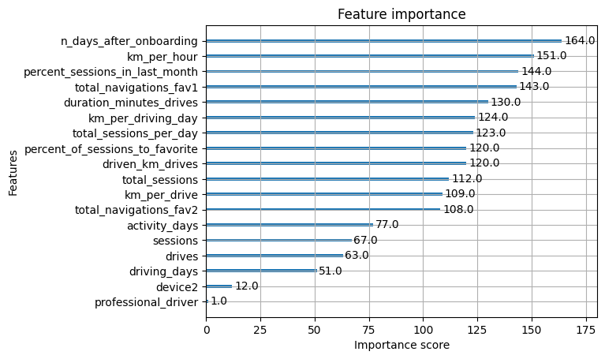
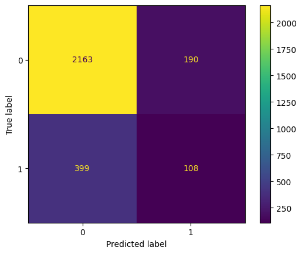

# Random-Forest-and-XGBoost-on-Predicting-User-Churn

## Introduction
This document presents details on the process and results of creating a machine learning model to predict user churn using data that encompasses a user’s driving pattern and frequency. We have evalutated the performance of two models: Random Forest and XGBoost to enhance further exploratory research.

## Problem
This project is part of a larger effort at Waze to increase growth. Typically, high retention rates indicate satisfied users who repeatedly use the Waze app over time. Developing a churn prediction model will help prevent churn, improve user retention, and grow Waze’s business. An accurate model can also help identify specific factors that contribute to churn and answer questions such as: 
* Who are the users most likely to churn?
* Why do users churn? 
* When do users churn?

## Response
The team developed two supervised machine learning models to classify whether a user is likely to churn or not. We decided the best models to use were: Random Forest and XGBoost. These models are known for creating accurate and reliable predictions and require little preprocessing or transforming of the data, allowing us to speed the model creation process along.

For preparation, we split the available data into three groups: training, validating, and testing. This allows us to train and test each individual model, then evaluate its performance using data that it has never seen before. This allows us to accurately predict future user patterns.
Using an interative process, we tuned the parameters of each model to ensure the most accurate version of each. 

## Impact
* Through evaluating our models, we determined that there is a critical need for additional data in order to more accurately predict user churn. 
* Though we were able to effectively predict whether a user were to retain, our models tended to give many false negatives. Meaning if we were to use this model to determine which users to give insentives to, we would miss many users who are likely to churn.
* Other valuable insights to gather would be driver activity within the app (i.e. how often to they report or confirm hazards), where the drivers geographically located, the amount of traffic the driver experiences during their trip, or the time of day in which they are driving.
* Additionally, since many of our engineered or calculated features proved important in their impact to model accuracy,  it may be valuable to further engineer variables that are representative of user behaviors.
  
## Conclusion
* Engineered features accounted for 6/10 of the top features
* The XGBoost model fit the data better than the random forest model. Recall particularly improved by 83%.
* The tree-based models are a more accurate predictor than a single logistic regression, though their results are more interpretable.
* Evaluating the models on validation data proves that the models are robust to extrapolation
  

